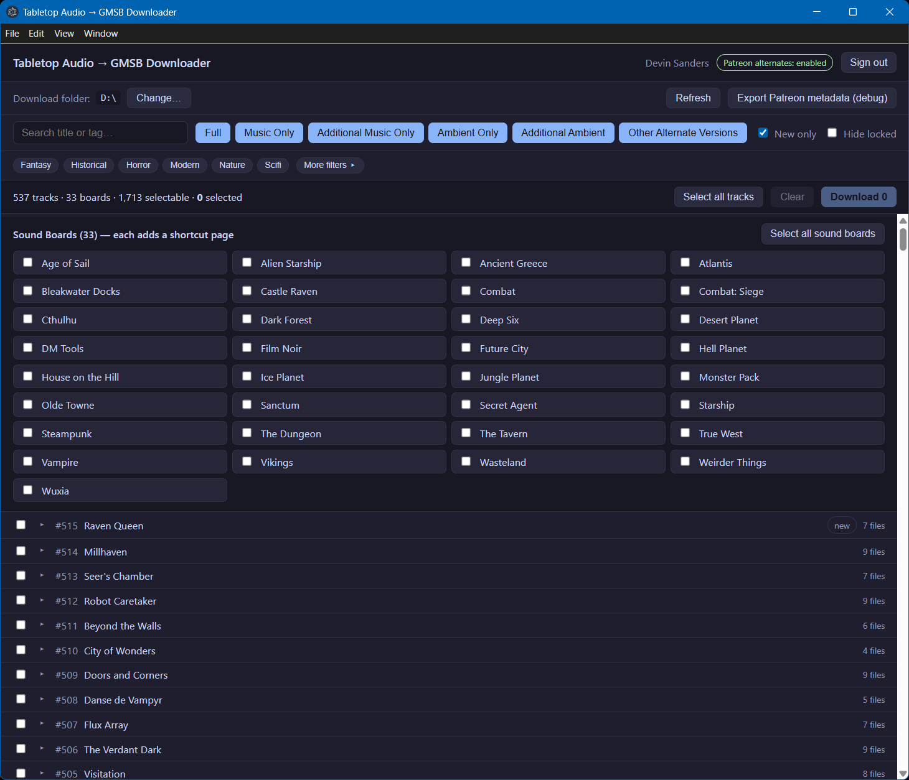
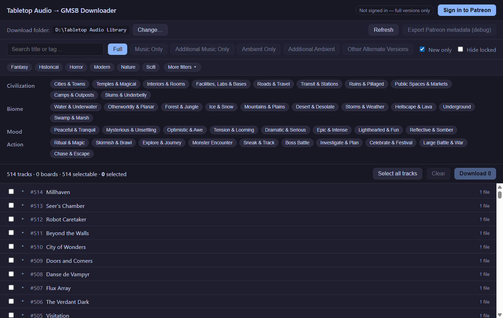

# Tabletop Audio → GMSB Downloader

A cross-platform desktop app (Windows, macOS, Linux) that downloads
[Tabletop Audio](https://tabletopaudio.com) tracks — the free full versions for
everyone, and the Patreon alternate versions (music-only, ambience-only, and
isolation alternates) plus the SoundPads for paying patrons — and maintains an
importable [Game Master Sound Board](https://github.com/DevinSanders/game-master-soundboard)
library so your GMSB library can be refreshed whenever you download new files.

It only ever accesses content your own account/tier already grants. See
[Legal & fair use](#legal--fair-use) below.

## Screenshots

Signed in with Patreon access: every track lists its available files (Full, the
music/ambient stems, and alternates), and each **Sound Board** can be added as a
GMSB shortcut page. Filter by variant, genre, or search, then select and download.



**More filters** exposes the same Mood / Biome / Civilization / Action categories
the Tabletop Audio website uses:



## Download & install

Grab the latest build from the
[**Releases**](https://github.com/DevinSanders/tabletop-audio-gmsb-downloader/releases/latest)
page and pick the file for your system:

| OS | File | Notes |
|----|------|-------|
| **Windows** | `...-setup.exe` | Run the installer. |
| **macOS (Apple Silicon)** | `...-arm64.dmg` | M1/M2/M3/M4 Macs. |
| **macOS (Intel)** | `...-x64.dmg` | Older Intel Macs. |
| **Linux** | `...-x86_64.AppImage` | `chmod +x` then run. |
| **Linux (Debian/Ubuntu)** | `...-amd64.deb` | `sudo apt install ./<file>.deb` |

> **The builds are unsigned** (this is a free project without paid code-signing
> certificates), so your OS may warn you the first time:
>
> - **Windows:** SmartScreen shows "Windows protected your PC" → **More info** →
>   **Run anyway**.
> - **macOS:** if it says the app "can't be opened" or "is damaged", right-click
>   the app → **Open** (then confirm), or run once in Terminal:
>   `xattr -dr com.apple.quarantine "/Applications/TTA GMSB Downloader.app"`.
> - **Linux:** make the AppImage executable (`chmod +x *.AppImage`) before running.

## Using the app

1. **Sign in to Patreon once.** A login window opens on first use; your session
   is remembered across launches (no manual cookies, no stored password). The
   free full versions work even without signing in.
2. **Choose a download folder.**
3. **Filter and select.** Search by title/tag, filter by the six genres, or open
   **More filters** for the same **Mood / Biome / Civilization / Action**
   categories the website uses. Pick variants — **Full**, **Music Only**,
   **Additional Music Only**, **Ambient Only**, **Additional Ambient**, **Other**
   — per track, or grab whole **Sound Boards** (each becomes a shortcut page).
4. **Download.** Files land under your folder, organized by type, and a
   `gmsb-library.json` is written/updated alongside them.

Re-runs only download what is new; the library is updated incrementally.

## Importing into GMSB

Open `gmsb-library.json` from Game Master Sound Board's library import. Paths are
absolute, so files resolve directly on the same machine. If you move the folder
or import on another computer, add the download folder as a search root on import
and GMSB's path resolver will relocate the files by name.

## Build from source

Requires Node.js 18+.

```bash
npm install
npm run dev        # launch with hot reload
npm test           # unit tests
npm run typecheck
npm run build      # produce out/ bundles
npm run package    # build installers into dist/ (electron-builder)
```

Releases are produced by GitHub Actions: pushing a `vX.Y.Z` tag builds installers
on Windows/macOS/Linux runners and attaches them to a draft GitHub Release.

See [CONTRIBUTING.md](CONTRIBUTING.md) for the project layout, conventions, and
the non-obvious footguns before opening a PR.

## About this project

This is a free companion tool for Game Master Sound Board, shared under the MIT
license.

- **AI-assisted development.** This application contains AI-generated content:
  much of its source, tests, and documentation were drafted with the help of AI
  tools. The project was **fully designed, directed, reviewed, and integrated by
  the author** — AI is one of the tools used to build it, not a substitute for
  the design and the decisions behind it.
- **Binaries are best-effort.** Pre-built installers exist for Windows, macOS
  (Intel + Apple Silicon), and Linux, but not every OS / distro combination is
  tested. If yours misbehaves, please file an issue.

## Legal & fair use

This tool automates downloading content **your own Patreon account and tier
already entitle you to**, for personal use. Full versions are fetched from
Tabletop Audio's public links; alternates and SoundPads come from Patreon and
require the appropriate paid tier. Patreon's Terms of Service restrict automated
access, so use this responsibly with your own account. All audio remains the
property of Tabletop Audio; this project does not host, redistribute, or bundle
any audio content.

## License

[MIT](LICENSE) © 2026 Devin Sanders.
